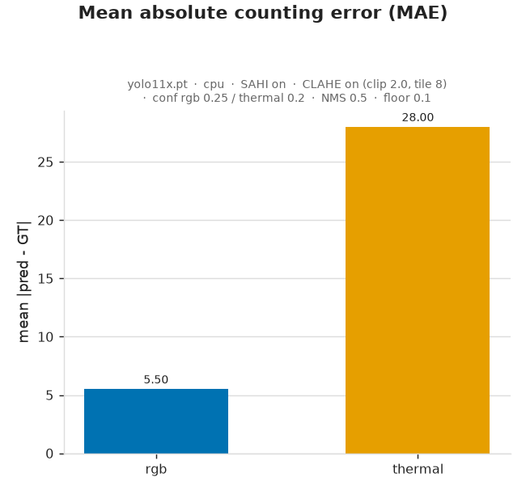

# 5. Evaluation and Metrics

*Person Counting in RGB and Thermal Drone Images — Take-Home Assignment (Stav)*

This document reports the evaluation of the baseline pipeline against the
hand-annotated ground truth and the required metrics (item #5). The result analysis
(item #6) is in [doc 6](6_result_analysis.md), and the RGB-vs-thermal comparison
(item #7) is in [doc 7](7_rgb_vs_thermal_comparison.md).

---

## 5.1 Methodology

- **Model / settings:** Ultralytics **YOLO11x** with **SAHI** tiled inference, at
  the default operating point — confidence **0.25 (RGB) / 0.20 (thermal)**, NMS IoU
  **0.5** (see docs 1–2 for why these were chosen).
- **Evaluation set:** the **8 point-annotated images** (4 RGB + 4 thermal pairs)
  described in doc 4. RGB and thermal are scored **separately**.
- **Matching rule:** a predicted box is a **true positive (TP)** if it contains an
  as-yet-unmatched ground-truth point; matching is greedy by descending confidence,
  one box ↔ one point. A box with no point inside is a **false positive (FP)**; a
  ground-truth point inside no box is a **false negative (FN)**. From these:
  precision = TP/(TP+FP), recall = TP/(TP+FN), F1 = harmonic mean; and per image the
  counting error = |predicted − ground truth|, averaged into **MAE**.
- Code: `evaluation/metrics.py` (matching + metrics), `evaluation/evaluate.py`
  (runner), `evaluation/plots.py` (charts). Outputs live in `../evaluation/first_run/results/`.

---

## 5.2 Required metrics

### Per-image results

| Image | Modality | GT | Pred | Abs err | TP | FP | FN | Precision | Recall | F1 |
|-------|----------|---:|-----:|--------:|---:|---:|---:|----------:|-------:|---:|
| 0004_V | rgb | 81 | 79 | 2 | 72 | 7 | 9 | 0.91 | 0.89 | 0.90 |
| 0006_V (19:08:03) | rgb | 25 | 22 | 3 | 21 | 1 | 4 | 0.95 | 0.84 | 0.89 |
| 0005_V | rgb | 46 | 40 | 6 | 37 | 3 | 9 | 0.93 | 0.80 | 0.86 |
| 0006_V (19:09:10) | rgb | 111 | 100 | 11 | 93 | 7 | 18 | 0.93 | 0.84 | 0.88 |
| 0004_T | thermal | 66 | 27 | 39 | 25 | 2 | 41 | 0.93 | 0.38 | 0.54 |
| 0006_T (19:08:03) | thermal | 10 | 1 | 9 | 1 | 0 | 9 | 1.00 | 0.10 | 0.18 |
| 0005_T | thermal | 25 | 0 | 25 | 0 | 0 | 25 | 0.00 | 0.00 | 0.00 |
| 0006_T (19:09:10) | thermal | 59 | 20 | 39 | 14 | 6 | 45 | 0.70 | 0.24 | 0.35 |

### Per-modality summary

| Modality | Images | GT total | Pred total | **MAE** | **Precision** | **Recall** | **F1** | TP | FP | FN |
|----------|-------:|---------:|-----------:|--------:|--------------:|-----------:|-------:|---:|---:|---:|
| **RGB**     | 4 | 263 | 241 | **5.50**  | **0.925** | **0.848** | **0.885** | 223 | 18 | 40 |
| **Thermal** | 4 | 160 | 48  | **28.00** | **0.833** | **0.250** | **0.385** | 40 | 8 | 120 |

Figures (in `../evaluation/first_run/results/plots/`):

### Metrics reported *with reason for omission*

- **F1** — reported (above).
- **Average inference time** — not captured systematically in this manual run;
  qualitatively, on CPU each RGB image took **~30–60 s** (SAHI tiling of a 12 MP
  frame) and thermal images were faster. Systematic timing is a small follow-up.
- **mAP@0.5** — **omitted**: it needs box-level ground truth, and our ground truth
  is **points** (doc 4). Point-in-box precision/recall is the appropriate substitute.
- **Performance by person size** — **omitted**: point ground truth carries no size,
  so per-size recall cannot be measured from it.

### False-positive / false-negative examples

Per-image overlays are in `../evaluation/first_run/results/examples/` (green = TP box,
red = FP box, blue = matched GT point, yellow = missed GT point). The thermal
example below is representative — **41 missed vs 25 found, only 2 false positives**:

- **False positives** (few): a warm blob or edge-sharpening artefact read as a
  person in thermal; occasional object in RGB. Precision stays high (0.83–0.93).
- **False negatives** (many, especially thermal): small/low-contrast warm blobs and
  people in dense clusters that the COCO-pretrained model does not fire on.

---

## 5.3 Limitations of the evaluation

- **Small, single-condition sample** (8 images, one location, one dusk session):
  results are **indicative, not generalisable**.
- **Point-based matching** scores a box as correct if it merely contains a GT point;
  it does not penalise loose boxes. This is appropriate for a **counting** task but
  is looser than IoU/mAP.

The result analysis (item #6, incl. the effect of settings and recommended next
steps) is in [doc 6](6_result_analysis.md); the RGB-vs-thermal comparison (item #7)
is in [doc 7](7_rgb_vs_thermal_comparison.md).

---

## 5.4 AI-assistance disclosure

The evaluation code (`evaluation/metrics.py`, `evaluation/plots.py`,
`evaluation/evaluate.py`) was written with AI assistance and reviewed by the
candidate. The metrics and figures above are computed directly from the
model predictions and the human-made ground truth.
