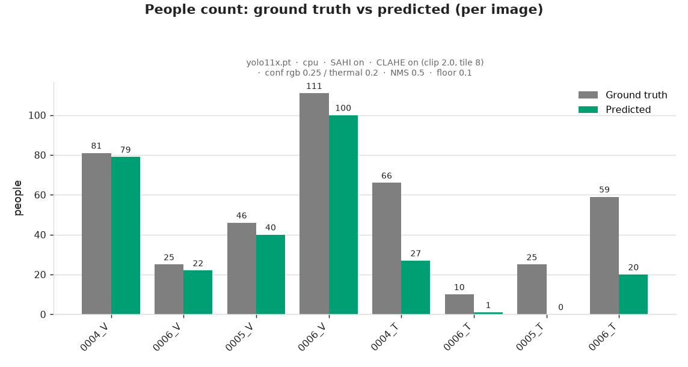
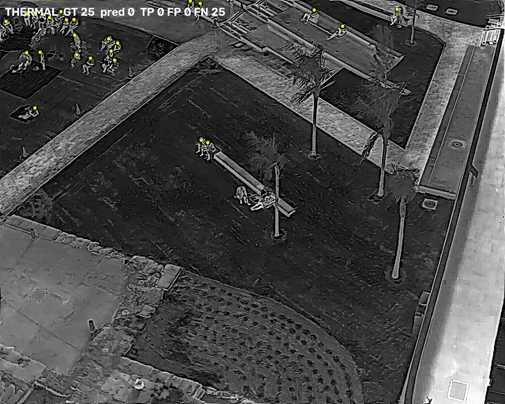
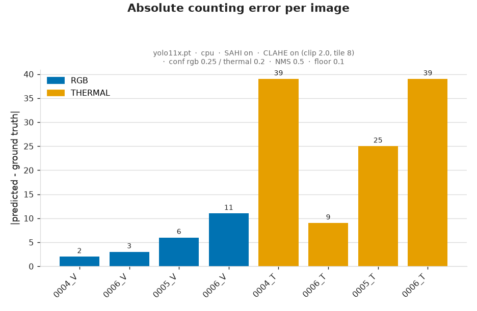
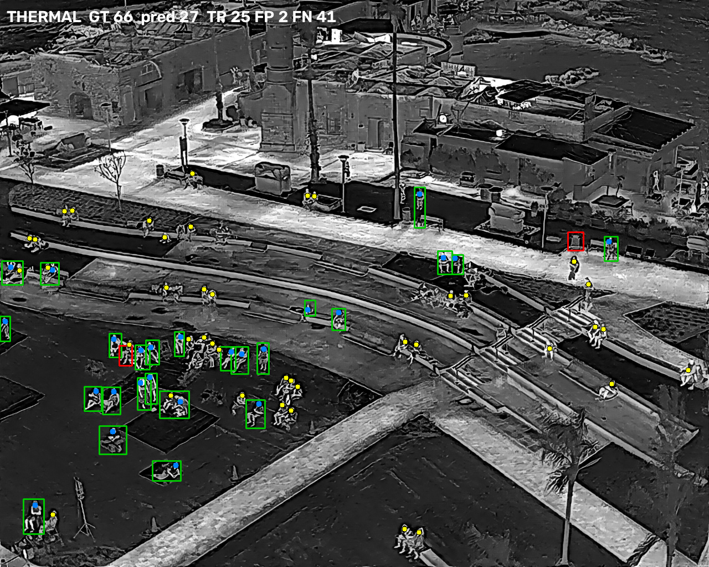
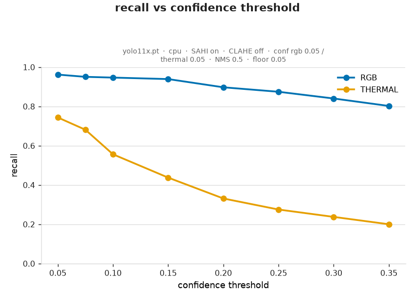
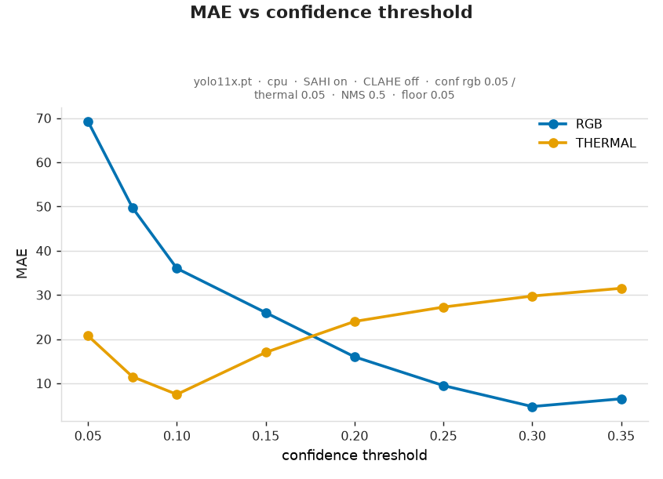
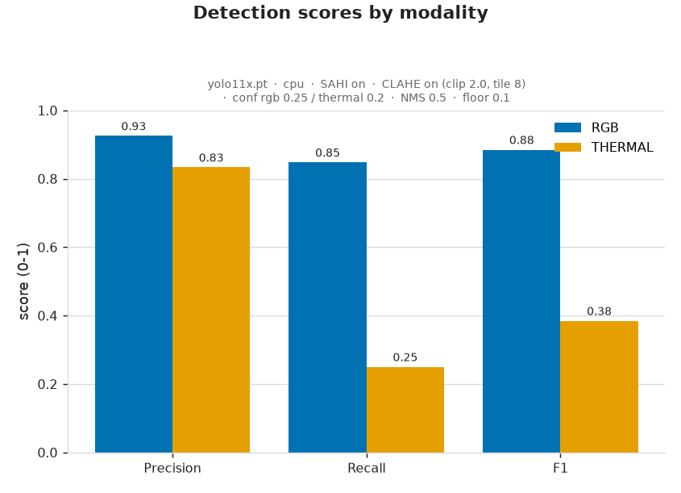

# 6. Result Analysis

*Person Counting in RGB and Thermal Drone Images — Take-Home Assignment (Stav)*

This document analyses the evaluation results (item #6). The metrics, figures, and
false-positive / false-negative examples it refers to are in
[doc 5](5_evaluation_and_analysis.md); the deeper modality comparison is in
[doc 7](7_rgb_vs_thermal_comparison.md).

---

## Where the model did well

RGB is strong: **F1 0.885, MAE 5.5** people across frames holding 25–111 people, with
**precision 0.93**. Counting error is small even on the densest frame (111 → 100). The
detector reliably finds upright and seated people on grass and promenade.

*Ground-truth vs predicted counts per image (baseline). The RGB pairs track closely; the
thermal bars fall far short of ground truth.*

*RGB on the densest frame (111 people): boxes are almost all **green** (true positives),
with only a few **yellow** missed points in the tightest clusters. Overlay key: green box =
true positive, red box = false positive, blue point = matched person, yellow point = missed
person.*

## Where the count was wrong

Thermal is poor at the shipped defaults: **recall 0.25, MAE 28**, and one frame
(`0005_T`, 25 people) produced **zero detections** — even at the tuned thermal threshold
(0.10) it recovers only 3 of 25, the clearest domain-mismatch case (see *Effect of
settings* below). All modality-level error is **under-counting** (predicted totals below
ground truth: RGB 241/263, thermal 48/160).

*`0005_T` at the baseline: **every** ground-truth person (yellow) is missed — the detector
returned zero boxes. The starkest domain-mismatch case.*

*Per-image counting error (baseline). The tall bars are all **thermal** (orange); RGB error
stays low.*

## Likely causes of false positives and false negatives

- **False negatives dominate**, and are the whole story in thermal. The COCO-pretrained
  YOLO11x has never seen `WhiteHot`, contrast-processed thermal imagery, so a warm human
  blob simply does not match its learned "person" appearance — exactly the
  domain-mismatch risk flagged in docs 1–2. Per-frame auto-gain variation (doc 1) makes
  it worse: `0005_T` normalised such that people barely stood out, and the detector
  found nothing.
- In **RGB**, the residual FNs are **dense-cluster** members (overlapping bodies merged
  or suppressed) and the **smallest / most-occluded** people.
- **False positives are rare** in both — the model is conservative at these thresholds,
  so precision is high and the accuracy ceiling is set by recall.

*`0004_T` (baseline): the model finds some people (**green**) but misses many (**yellow**) —
under-detection from domain mismatch, not false alarms.*

## Effect of confidence / input resolution / IoU / NMS settings

Quantified by the ablation (runs 1–3; full detail in
[`evaluation/ablation_results.md`](../evaluation/ablation_results.md) and
[`evaluation/third_run/run3_analysis.md`](../evaluation/third_run/run3_analysis.md)):

- **Confidence — the biggest thermal lever.** A low-floor sweep shows thermal is
  *under-confident, not blind*: at a low threshold the model fires on **74 %** of thermal
  people — they simply score below the 0.20 default. Dropping thermal **0.20 → 0.10**
  (CLAHE off) roughly **halves counting error (MAE 24.75 → 11.75)** and lifts F1
  0.46 → 0.61. RGB wants the *opposite* — it is recall-saturated, so a **higher**
  threshold (~0.25–0.30) is best. The two modalities' optima sit on opposite ends, which
  is exactly why the pipeline keeps **separate per-modality thresholds**. **Precision is
  the thermal ceiling** (F1 caps ~0.67): recovering recall floods in false positives, so
  tuning makes thermal *usable*, not *good*.

  
  

  *Confidence sweep (run 3). Left: thermal **recall climbs sharply as the threshold drops** —
  the people are there, just low-scoring. Right: thermal **MAE bottoms out near 0.10** while
  RGB prefers ~0.25–0.30 — the two modalities want opposite ends of the range.*
  **Note:** these values come from re-thresholding the low **0.05-floor** capture, where
  SAHI switches its tile-merge (`NMS/IOU`), so read them for **shape** (where each optimum
  sits), not absolute values. The faithful absolute numbers are the **operating-point run**
  (RGB 0.25 / thermal 0.10 → MAE 5.5 / 11.75); see
  [`evaluation/third_run/run3_analysis.md`](../evaluation/third_run/run3_analysis.md).

- **CLAHE — thermal preprocessing.** A full clip × tile grid was swept: **no CLAHE
  setting beats "off"** — every one trades a little precision up for a lot of recall down.
  CLAHE off is the better thermal setting, though the gain is small (MAE 28 → 24.75).
- **SAHI / input resolution.** Tiled inference is doing the heavy lifting — without it a
  12 MP frame downscaled to 640 px would lose almost all of these small people (doc 1).
  It is essential to the RGB result. (Decisive qualitatively; not swept numerically.)
- **NMS IoU (0.5).** A moderate value; too low merges adjacent people in dense clusters
  (more FN), too high splits individuals (more FP). Its effect concentrates in the dense
  RGB clusters. (Left as future work — thermal misses are *non-detection*, not
  over-merging, so NMS is not the thermal bottleneck.)

## Main difference between RGB and thermal performance

RGB vastly outperforms thermal (**F1 0.885 vs 0.385**, **MAE 5.5 vs 28** at the shipped
defaults; the thermal ablation narrows it to **F1 0.885 vs 0.61 / MAE 5.5 vs 11.75**,
still a clear RGB win), and the gap is almost entirely **recall** (0.85 vs 0.25), not
precision (0.93 vs 0.83) — i.e. the thermal model *misses* people rather than inventing
them. The full comparison, and why, is in [doc 7](7_rgb_vs_thermal_comparison.md).

*Precision / recall / F1 per modality (baseline). Precision is comparable across modalities;
the gap is almost entirely **recall** — thermal misses people rather than inventing them.*

## Recommended next steps (analysis)

- **Thermal needs a thermal-appropriate model.** The single highest-impact step is
  fine-tuning on a **thermal pedestrian dataset (e.g. FLIR ADAS)** or using a
  thermal-native detector; the pretrained COCO model is the wrong tool for `WhiteHot`
  imagery. Lowering the thermal confidence threshold is a **quantified** cheap mitigation
  (0.10 roughly halves counting error), but precision — not the threshold — is the wall.
- **Quantitative ablation done** (runs 1–3): confirmed CLAHE off via a clip × tile grid,
  quantified the confidence effect, and identified the thermal operating point (~0.10).
  See [`evaluation/ablation_results.md`](../evaluation/ablation_results.md) and
  [`evaluation/third_run/run3_analysis.md`](../evaluation/third_run/run3_analysis.md).
  The shipped defaults are kept **conservative** (CLAHE on, thermal 0.20) as the chosen
  baseline; the ablation documents the better operating point rather than changing it.