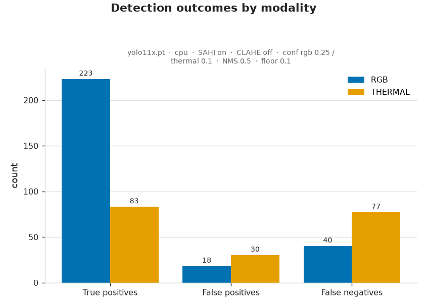

# 7. RGB vs Thermal Comparison

*Person Counting in RGB and Thermal Drone Images — Take-Home Assignment (Stav)*

This document compares the two modalities (item #7). It builds on the metrics in
[doc 5](5_evaluation_and_analysis.md) and the analysis in
[doc 6](6_result_analysis.md).

---

- **Which was more accurate?** **RGB, decisively.** Comparing each modality at its
  **best** operating point — RGB @ 0.25, thermal at **CLAHE off / 0.10** — RGB still
  leads clearly: F1 **0.885 vs 0.608**, MAE **5.5 vs 11.75**. (At the shipped conservative
  defaults the gap is wider still: F1 0.885 vs 0.385, MAE 5.5 vs 28 — see
  [`evaluation/third_run/run3_analysis.md`](../evaluation/third_run/run3_analysis.md).)
  RGB was more accurate on every pair.

  
  

  *Precision / recall / F1 and MAE per modality, each at its **best** setting. Even so,
  RGB leads on every metric, with roughly half the counting error.*
- **When was thermal more effective?** Not in this dataset. Thermal's inherent
  advantage — bodies glowing against a cool background — appears in some frames, but
  the **COCO-pretrained detector cannot exploit it**, so that advantage went
  unrealised. Thermal would be expected to win in **darkness / no visible light**,
  which this dusk scene does not present, and only with a **thermal-appropriate
  detector**.
- **When was RGB more effective?** In this **evening/daylight** scene RGB carries
  rich texture the model was trained on, so it wins across the board.
- **Main error sources per modality.** RGB: mild under-counting in **dense clusters**
  + a few object false positives. Thermal: massive **false negatives** from
  **domain mismatch** (non-thermal-trained model), amplified by per-frame gain
  variation and small target size. Lowering the thermal threshold (0.10) recovers a
  large share of those FNs — the model was under-confident, not blind — but the recovered
  detections bring false positives, so **precision becomes the limiting factor**.

  

  *TP / FP / FN per modality at their best settings. Thermal's error is still dominated by
  **false negatives** (missed people), but at the low 0.10 threshold **false positives now
  appear** — the precision cost of recovering recall.*
- **Could one modality validate the other?** Yes — this is the most promising use of
  the pair. Because the two sensors are rigidly mounted (doc 1), a **fixed homography**
  maps between them. A practical future-fusion proposal: run the strong **RGB**
  detector, project its detections into the thermal frame to **confirm or seed**
  thermal detections (recovering thermal FNs), and conversely use thermal warm-blob
  evidence to **validate** RGB detections in shadowed regions. Full fusion is out of
  scope here (doc 2); this comparison shows exactly why it is worth doing.
