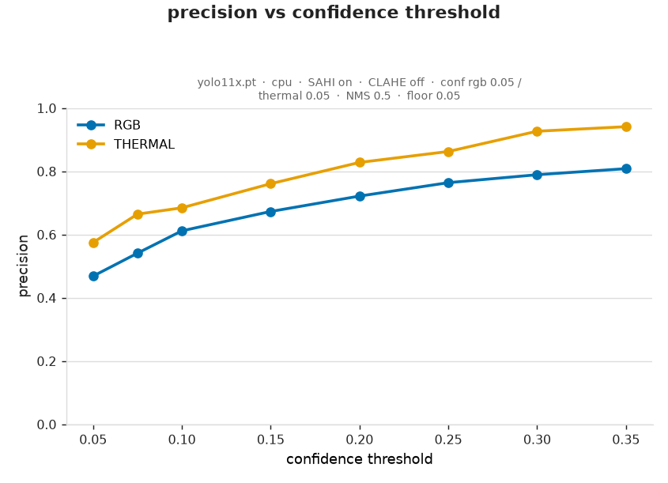
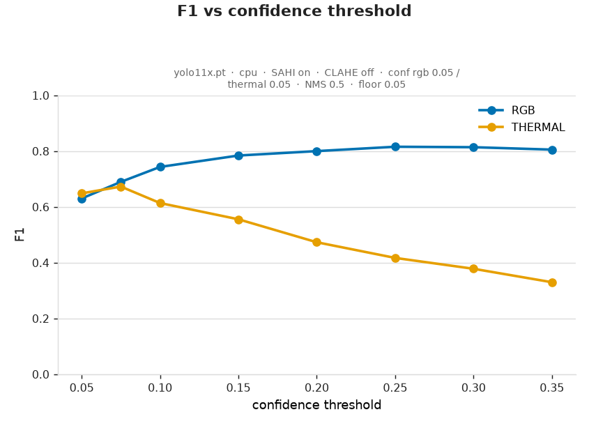
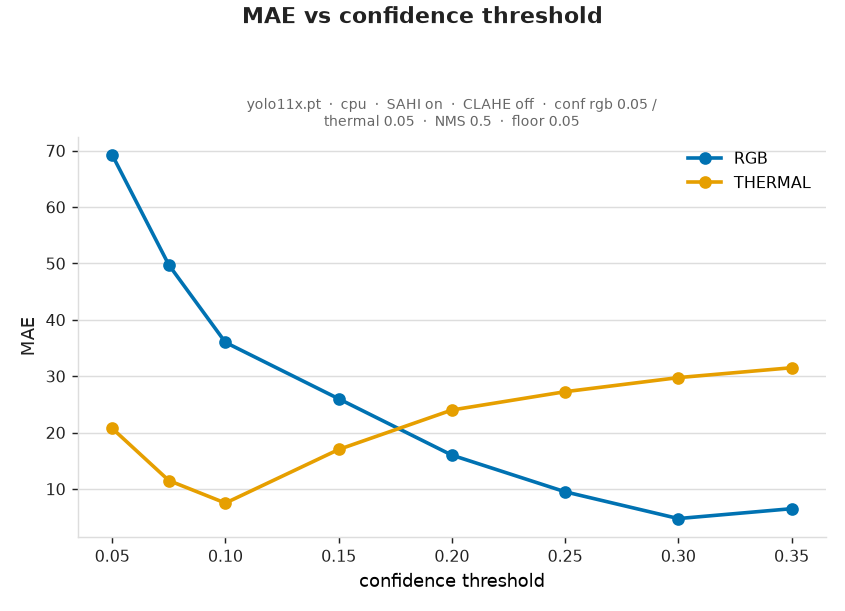
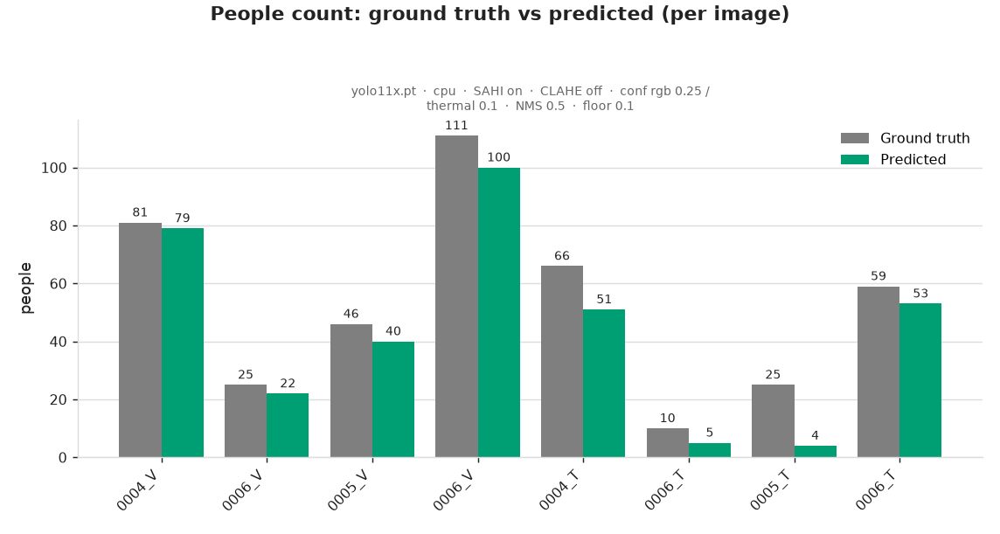
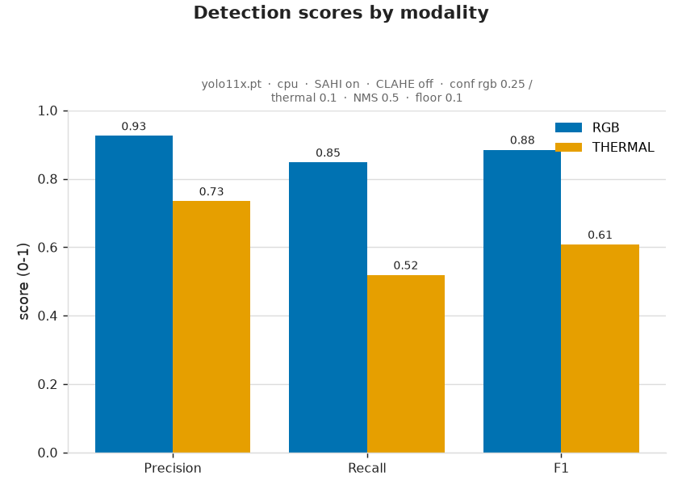
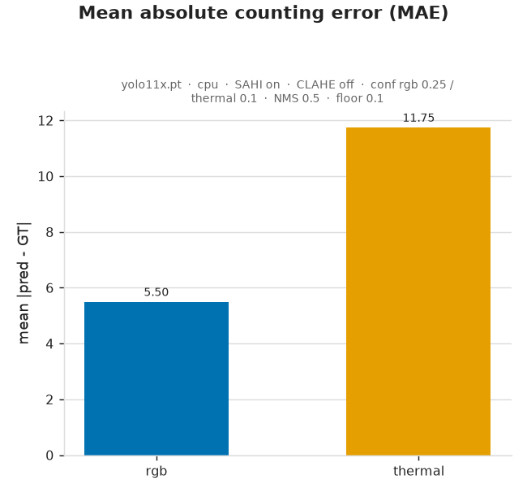
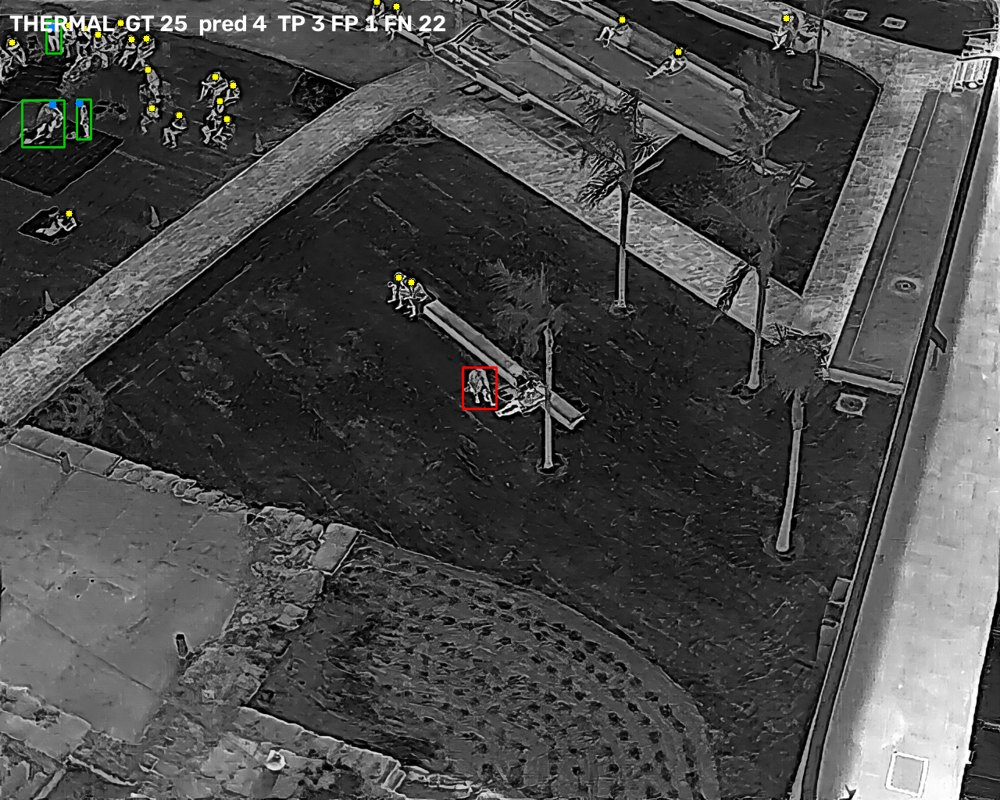
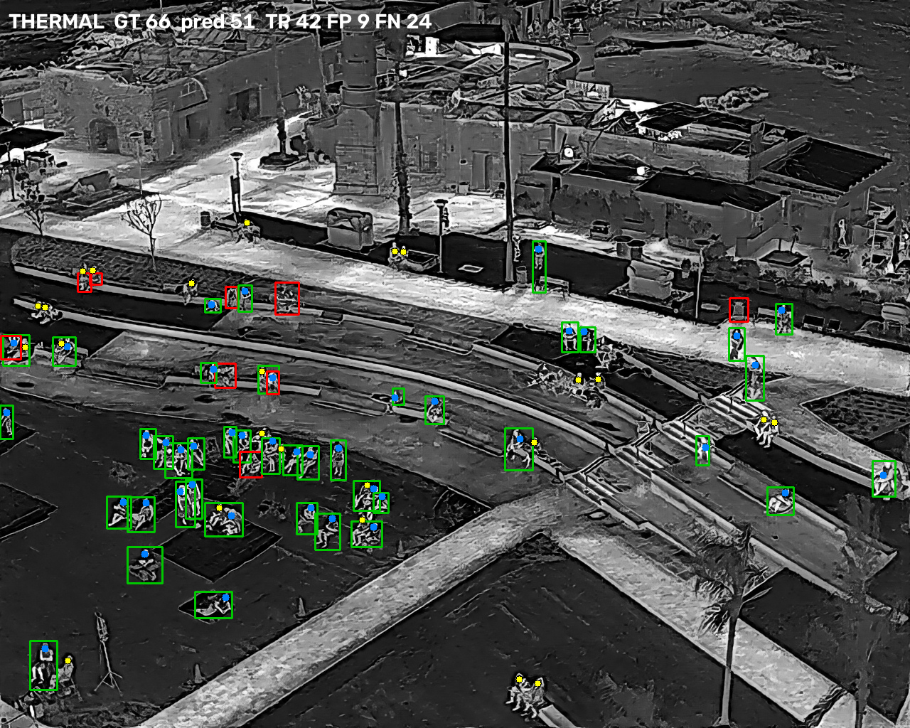

# Run 3 Analysis — Confidence sweep + operating-point evaluation

*Person Counting in RGB and Thermal Drone Images — Take-Home Assignment (Stav)*

Run 3 answers the question runs 1–2 could not: **where should the per-modality
confidence threshold sit, and what does the best thermal operating point actually
buy us?** It has two parts:

1. **A low-floor confidence sweep** (`sweep_run/sweep/`) — one capture at a confidence floor of
   **0.05**, then the metrics re-computed at a range of thresholds. This maps the whole
   precision/recall/F1/MAE curve for each modality without re-running the model.
2. **An operating-point run** (`after_sweep_run/`) — a normal, baseline-faithful run at
   the thresholds the sweep recommends (**RGB 0.25 / thermal 0.10**, CLAHE off), scored
   with per-image metrics, plots, and FP/FN example overlays.

Everything else is held at the run-2 configuration: YOLO11x, SAHI on, CLAHE off,
NMS IoU 0.5.

---

## Part A — The confidence sweep (floor 0.05)

**Why one run is enough.** The confidence threshold is applied *after* detection, and
both SAHI's tile merge and our NMS are greedy by descending score, so re-thresholding
the saved detections at any value T is *exact* — identical to running the whole pipeline
at T. One low-floor capture therefore covers the entire sweep. The floor was set to
**0.05** (`--base-conf 0.05 --rgb-conf 0.05 --thermal-conf 0.05`) so the saved JSON keeps
every detection down to 0.05 — including the weak thermal ones we want to study.

### Sweep results

| thr | RGB P | RGB R | RGB F1 | RGB MAE | · | Thermal P | Thermal R | Thermal F1 | Thermal MAE |
|---:|---:|---:|---:|---:|---|---:|---:|---:|---:|
| 0.05  | 0.469 | 0.962 | 0.630 | 69.25 | · | 0.575 | **0.744** | 0.649 | 20.75 |
| 0.075 | 0.541 | 0.951 | 0.690 | 49.75 | · | 0.665 | 0.681 | **0.673** | 11.50 |
| 0.10  | 0.612 | 0.947 | 0.743 | 36.00 | · | 0.685 | 0.556 | 0.614 | **7.50** |
| 0.15  | 0.673 | 0.939 | 0.784 | 26.00 | · | 0.761 | 0.438 | 0.556 | 17.00 |
| 0.20  | 0.722 | 0.897 | 0.800 | 16.00 | · | 0.828 | 0.331 | 0.473 | 24.00 |
| 0.25  | 0.764 | 0.875 | **0.816** | 9.50 | · | 0.863 | 0.275 | 0.417 | 27.25 |
| 0.30  | 0.789 | 0.840 | 0.814 | **4.75** | · | 0.927 | 0.237 | 0.378 | 29.75 |
| 0.35  | 0.808 | 0.802 | 0.805 | 6.50 | · | 0.941 | 0.200 | 0.330 | 31.50 |

### What the sweep shows

- **Thermal is under-confident, not blind.** At a low threshold the model actually fires
  on **74 % of thermal people** (recall 0.744 at 0.05) — they were simply scoring below
  the 0.20 default and being discarded. The problem was never "the model can't see
  thermal people"; it was "their scores sit near the noise floor."
- **Thermal's sweet spot is ~0.075–0.10.** F1 peaks at 0.075 (0.673) and counting error
  (MAE) bottoms out at 0.10 (7.50) — versus 24 at the old 0.20 default. That is the
  single biggest thermal-counting lever we found.
- **Precision is the ceiling.** Recovering that recall floods in false positives
  (precision 0.575 at 0.05), so thermal F1 caps around **0.67** wherever you sit — you
  cannot get high recall *and* high precision by threshold alone. Only a fine-tuned
  thermal model lifts the whole curve (docs 6–8).
- **RGB wants the opposite end.** It is recall-saturated at low thresholds (0.96 at 0.05)
  but drowning in false positives (MAE 69), so it wants a *higher* threshold: F1 peaks at
  ~0.25 and counting (MAE 4.75) is best at ~0.30. This confirms the **per-modality
  threshold design** — the two modalities' optima are on opposite sides of the range.

---

## Part B — Operating-point run (RGB 0.25 / thermal 0.10)

The sweep points at RGB ≈ 0.25 and thermal ≈ 0.10. This is a normal run at those
thresholds (`--rgb-conf 0.25 --thermal-conf 0.10 --base-conf 0.10`), so the annotated
images and metrics are real and inspectable — not a re-threshold.

### Headline metrics

| Modality | Precision | Recall | F1 | MAE |
|---|---:|---:|---:|---:|
| **RGB** (0.25) | 0.925 | 0.848 | **0.885** | **5.50** |
| **Thermal** (0.10) | 0.735 | 0.519 | 0.608 | 11.75 |
| Overall | 0.864 | 0.723 | 0.788 | 8.625 |

**RGB is byte-identical to runs 1 & 2** (pred 241, TP 223, FP 18, FN 40) — confirming
this run uses the same detector path as the baseline, so the comparison below is clean.

### Effect of dropping thermal 0.20 → 0.10 (both CLAHE off)

| Thermal | Run 2 (thr 0.20) | Run 3 op (thr 0.10) |
|---|---:|---:|
| True positives | 51 | **83** |
| False positives | 10 | 30 |
| False negatives | 109 | **77** |
| Recall | 0.319 | **0.519** |
| F1 | 0.462 | **0.608** |
| MAE | 24.75 | **11.75** |

Lowering the thermal threshold found **32 more real people** (TP 51 → 83) and **roughly
halved the counting error** (MAE 24.75 → 11.75), at the cost of 20 extra false positives
(precision 0.836 → 0.735). For a *counting* task that is a clear win — the undercount was
the dominant error, and this closes half of it.

### Per-image thermal breakdown — the failure is image-specific

| Thermal image | GT | pred | TP | FP | FN | Recall |
|---|---:|---:|---:|---:|---:|---:|
| `0004_T` | 66 | 51 | 42 | 9 | 24 | 0.636 |
| `0006_T` (190910) | 59 | 53 | 35 | 18 | 24 | 0.593 |
| `0006_T` (190803) | 10 | 5 | 3 | 2 | 7 | 0.300 |
| `0005_T` | 25 | 4 | 3 | 1 | 22 | **0.120** |

Thermal is **bimodal**: on two frames the model recovers ~60 % of people, but on
**`0005_T` it finds only 3 of 25** even at the 0.10 threshold. That single image drags the
aggregate thermal recall down. It is the clearest illustration of domain mismatch — some
thermal scenes render people in a way the COCO-pretrained model simply does not fire on,
and no threshold recovers what was never detected.

*(Overlay key: green box = true positive, red box = false positive, blue point = matched
ground-truth person, yellow point = missed person.)*

---

## Caveats

- **The sweep is slightly optimistic vs the real run.** The sweep's re-thresholded
  thermal @ 0.10 reads MAE 7.50 / F1 0.614, but the *actual* run at thermal 0.10 gives
  MAE **11.75** / F1 0.608. The 0.05 floor tripped SAHI's low-confidence postprocess
  switch (`NMS/IOU`), which retains more overlapping detections than the baseline merge,
  so re-thresholding that set is internally exact but does **not** reproduce a real
  base-0.10 run. **Trust the operating-point numbers (11.75) as the deliverable; read the
  sweep for the *shape* and the operating point, not the absolute values.**
- **Small, single-condition sample** (8 images / 4 thermal, one dusk session). The
  recommended thresholds are indicative and would shift on new data.
- **Precision is the real thermal ceiling**, not the threshold — the durable fix is a
  fine-tuned thermal detector (docs 6–8).

---

## Conclusion & recommended operating point

- **RGB: threshold ≈ 0.25** — F1 0.885, MAE 5.5; robust, insensitive across 0.20–0.30.
- **Thermal: threshold ≈ 0.10** — halves counting error vs the 0.20 default
  (MAE 24.75 → 11.75, F1 0.462 → 0.608) by recovering under-confident detections.
- The two modalities want **opposite ends** of the threshold range, which validates the
  pipeline's separate per-modality thresholds.
- Thermal remains capped by **precision / domain mismatch**; threshold tuning takes it
  from "mostly misses" to "usable," but a fine-tuned model is needed to go further.

Artefacts: `sweep_run/sweep/` (sweep charts + `sweep.csv`), `after_sweep_run/results/`
(`summary.json`, `metrics_per_image.csv`, `plots/`, `examples/`).
